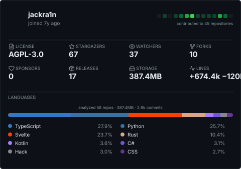

# metrics-rs

A fast, lightweight, dependency-minimal GitHub profile metrics card generator written in Rust.

Designed as an efficient native alternative to heavy JavaScript/Chromium-based profile metric tools.



---

## ✨ Features

- **⚡ Blazing Fast**: Single native compiled binary. Generates deterministic SVG cards in milliseconds (or ~30 seconds for complete `--indepth` commit analysis across 60+ repositories in parallel).
- **🎨 Pure Vector SVG**: Emits clean, dark-theme SVG without spinning up Puppeteer, Headless Chrome, Docker, or Node.js.
- **📊 Two Analysis Modes**:
  - **Fast API Mode** *(default)*: Instant calculation from GitHub GraphQL and REST endpoints.
  - **In-Depth Mode** (`--indepth`): Concurrent bare-clone analysis that inspects authored commit diffs to attribute exact lines added per language.
- **🟩 14-Day Contribution Heatmap**: Mini GitHub-style activity grid in the header, paired with lifetime contributed repository counts.
- **🈷️ GitHub Linguist Palette**: Bundled language colors and file classification matching GitHub Linguist, normalized across the top 8 languages.
- **📈 Balanced Stat Grid**: Key stats (license, stars, watchers, forks, sponsors, releases, storage, and colored `+`/`−` lines) formatted for dark backgrounds.
- **🖥️ Rich Terminal Summary**: Comprehensive stdout reporting detailing repository impact on the language bar, recent activity, and license distribution.

---

## 🚀 Installation

### Prerequisites
- [Rust](https://www.rust-lang.org/) (2024 edition / 1.85+)
- Git CLI (for `--indepth` mode)

### Build from source
```bash
git clone https://github.com/jackra1n/metrics-rs.git
cd metrics-rs
cargo build --release
```
The compiled binary will be located at `target/release/metrics-rs`.

---

## 💻 Usage

```bash
# Basic usage (reads token from GITHUB_TOKEN or GH_TOKEN)
export GITHUB_TOKEN="ghp_your_token_here"
./target/release/metrics-rs <USERNAME> <OUTPUT_SVG_PATH>

# In-depth authored commit analysis
./target/release/metrics-rs <USERNAME> <OUTPUT_SVG_PATH> --indepth

# In-depth mode with excluded languages
./target/release/metrics-rs <USERNAME> <OUTPUT_SVG_PATH> --indepth --ignore-languages swift,gdscript

# Passing token explicitly via flag
./target/release/metrics-rs <USERNAME> <OUTPUT_SVG_PATH> --token "ghp_..."
```

### CLI Options

| Argument / Flag | Description |
| :--- | :--- |
| `<USERNAME>` | Target GitHub username |
| `<OUTPUT>` | Destination path for the output `.svg` file |
| `--indepth` | Enable bare-clone Git log analysis for author-specific commit diffs |
| `--ignore-languages <csv>` | Comma-separated list of languages to exclude from ranking |
| `--token <TOKEN>` | GitHub Personal Access Token (defaults to `$GITHUB_TOKEN` or `$GH_TOKEN`) |

---

## 🔄 GitHub Actions Workflow

You can automate regenerating your profile card on a schedule or on push using GitHub Actions:

```yaml
name: Generate Metrics Card

on:
  schedule:
    - cron: "0 0 * * *" # Daily at midnight
  workflow_dispatch:
  push:
    branches: [main]

jobs:
  metrics:
    runs-on: ubuntu-latest
    permissions:
      contents: write
    steps:
      - name: Checkout repository
        uses: actions/checkout@v4

      - name: Install Rust
        uses: dtolnay/rust-toolchain@stable

      - name: Build metrics-rs
        run: cargo build --release

      - name: Generate metrics SVG
        run: ./target/release/metrics-rs ${{ github.repository_owner }} github-metrics.svg --indepth
        env:
          GITHUB_TOKEN: ${{ secrets.METRICS_TOKEN || secrets.GITHUB_TOKEN }}

      - name: Commit and push changes
        run: |
          git config user.name "github-actions[bot]"
          git config user.email "github-actions[bot]@users.noreply.github.com"
          git add github-metrics.svg
          git diff --quiet && git diff --staged --quiet || (git commit -m "chore: update metrics card" && git push)
```

---

## 🧪 Running Tests

```bash
cargo test
```

---

## 📄 License

This project is licensed under the **GNU Affero General Public License v3.0** (AGPL-3.0-only). See the [LICENSE](./LICENSE) file for details.
